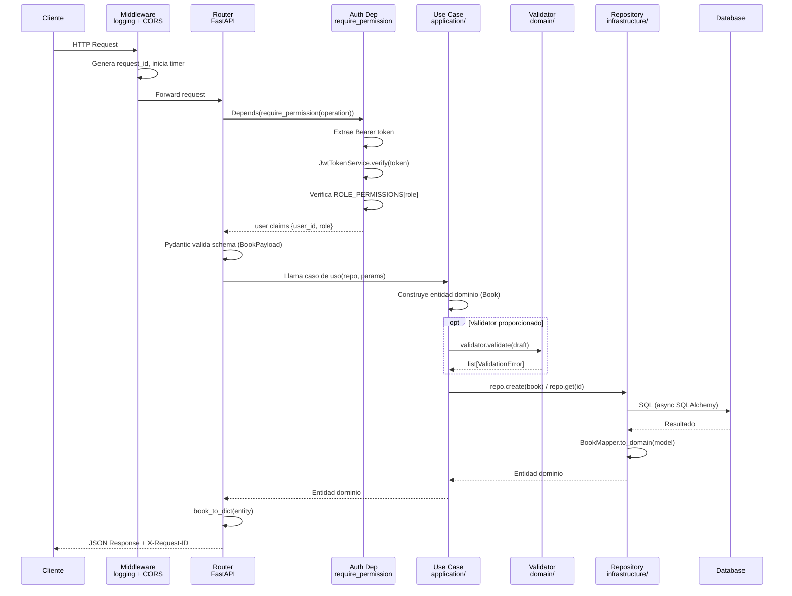
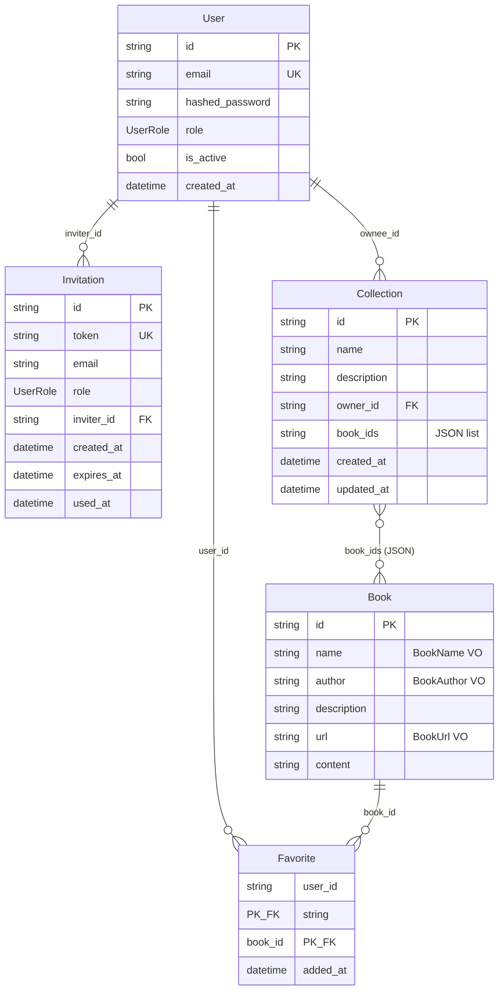
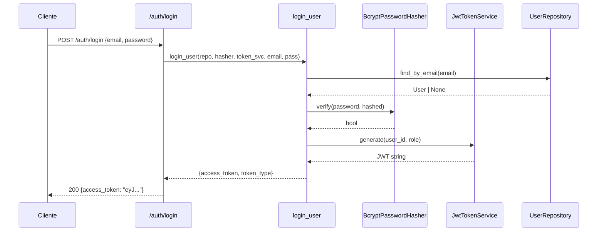

# Arquitectura de ai-dd

> **ai-dd** es una API REST para gestión de biblioteca digital construida con **FastAPI**, **SQLModel** (async SQLAlchemy) y principios de **Clean Architecture**. El dominio es puro — no depende de ningún framework externo. La autenticación usa JWT (HS256) con RBAC, y la persistencia soporta SQLite, PostgreSQL e InMemory mediante el patrón Repository + Data Mapper.

## Índice

1. [Principios](#1-principios)
2. [Mapa de Capas](#2-mapa-de-capas)
3. [Ciclo de Vida de una Request](#3-ciclo-de-vida-de-una-request)
4. [Modelo de Dominio](#4-modelo-de-dominio)
5. [Persistencia](#5-persistencia)
6. [Autenticación y Autorización](#6-autenticación-y-autorización)
7. [Manejo de Errores](#7-manejo-de-errores)
8. [Estrategia de Testing](#8-estrategia-de-testing)
9. [Configuración](#9-configuración)
10. [Decisiones Clave](#10-decisiones-clave)
11. [Estructura de Directorios](#11-estructura-de-directorios)

---

## 1. Principios

| Principio | Aplicación en ai-dd |
|-----------|---------------------|
| **Dependency Rule** | `api → application → domain`. El dominio no importa nada externo. |
| **Puertos y Adaptadores** | Interfaces abstractas en `domain/` (Puertos), implementaciones en `infrastructure/` (Adaptadores). |
| **Data Mapper** | `BookModel` (SQL) ≠ `Book` (dominio). Los mappers traducen entre ambos mundos. |
| **Value Objects** | `BookName`, `BookAuthor`, `BookUrl` son inmutables y validan en construcción. |
| **Composition Root** | `main.create_app()` es el único lugar que ensambla dependencias. |
| **Single Source of Truth** | `domain/validation_rules.py` centraliza todas las constantes de validación. |
| **Domain Errors** | Excepciones del dominio se convierten a HTTP en handlers de la capa API. |

---

## 2. Mapa de Capas

```
┌─────────────────────────────────────────────────────────┐
│                      api/                               │
│  Routers · Schemas (Pydantic) · Middleware · Mappers    │
│  Dependencias (DI) → inyecta repos y servicios          │
├─────────────────────────────────────────────────────────┤
│                   application/                           │
│  Casos de uso (funciones puras de orquestación)         │
│  create_book · login_user · add_favorite · etc.         │
├─────────────────────────────────────────────────────────┤
│                     domain/                              │
│  Entidades · Value Objects · Validators · ABC Repos     │
│  Auth: User · Invitation · Permissions · Ports          │
│  Collections · Favorites (repos ABC)                    │
│  ⚠ ZERO dependencias externas                           │
├─────────────────────────────────────────────────────────┤
│                 infrastructure/                          │
│  SQL repos · InMemory repos · JSON repo                 │
│  JWT service · Bcrypt hasher · Mappers                  │
│  Repository Factory · Registry                          │
├─────────────────────────────────────────────────────────┤
│                    config/                               │
│  AppSettings (pydantic-settings) → .env                 │
└─────────────────────────────────────────────────────────┘
```

| Capa | Paquete | Responsabilidad | Depende de | Archivos clave |
|------|---------|-----------------|------------|----------------|
| **API** | `src/api/` | Rutas HTTP, schemas Pydantic, middleware, DI | `application`, `domain`, `config` | `routers/books.py`, `middleware/auth.py`, `dependencies.py` |
| **Aplicación** | `src/application/` | Orquestación de casos de uso | `domain` | `use_cases/create_book.py`, `use_cases/auth/login_user.py` |
| **Dominio** | `src/domain/` | Lógica de negocio pura, entidades, VOs, puertos | *nada externo* | `entities.py`, `repositories.py`, `auth/ports.py` |
| **Infraestructura** | `src/infrastructure/` | Adaptadores: SQL, JWT, bcrypt, repos in-memory | `domain`, `sqlalchemy`, `pyjwt`, `bcrypt` | `persistence/sql_book_repository.py`, `auth/jwt_token_service.py` |
| **Configuración** | `src/config/` | Settings tipados desde `.env` | `pydantic-settings` | `settings.py` |

---

## 3. Ciclo de Vida de una Request



---

## 4. Modelo de Dominio



### Value Objects

| Value Object | Archivo | Validación |
|-------------|---------|------------|
| `BookName` | `domain/value_objects/book_name.py` | No vacío, ≤ 200 chars, trim automático |
| `BookAuthor` | `domain/value_objects/book_author.py` | No vacío, ≤ 150 chars, trim automático |
| `BookUrl` | `domain/value_objects/book_url.py` | Formato URL válido (scheme + netloc), ≤ 2048 chars |

Todos son `@dataclass(frozen=True, slots=True)` — inmutables, validan en `__post_init__`.

### Entidades de Autenticación

| Entidad | Archivo | Campos clave |
|---------|---------|--------------|
| `User` | `domain/auth/entities.py` | `id`, `email`, `hashed_password`, `role` (UserRole enum) |
| `Invitation` | `domain/auth/entities.py` | `token`, `email`, `role`, `inviter_id`, `expires_at`, `used_at` |
| `UserRole` | `domain/auth/entities.py` | `ADMIN`, `USER` (StrEnum) |

---

## 5. Persistencia

### Patrón Data Mapper

El dominio **nunca** se persiste directamente. Existe una separación explícita:

```
Domain Book  ←→  BookMapper  ←→  BookModel (SQLModel)
     ↕                              ↕
BookName VO                    books table
BookAuthor VO
BookUrl VO
```

| Mapper | Archivo | Traduce |
|--------|---------|---------|
| `BookMapper` | `infrastructure/persistence/book_mapper.py` | `Book` ↔ `BookModel` |
| `CollectionMapper` | `infrastructure/persistence/collection_mapper.py` | `Collection` ↔ `CollectionModel` (con JSON `book_ids`) |

### Modelos SQL

| Modelo | Tabla | Archivo |
|--------|-------|---------|
| `BookModel` | `books` | `infrastructure/persistence/sql_models.py` |
| `CollectionModel` | `collections` | `infrastructure/persistence/collection_models.py` |
| `FavoriteModel` | `favorites` | `infrastructure/persistence/favorite_models.py` |
| `UserModel` | `users` | `infrastructure/auth/sql_models.py` |
| `InvitationModel` | `invitations` | `infrastructure/auth/sql_models.py` |

### Repository Pattern

Cada recurso tiene un **puerto** (ABC en `domain/`) y al menos un **adaptador** (en `infrastructure/`):

| Puerto (ABC) | Adaptador SQL | Adaptador InMemory | Adaptador JSON |
|--------------|---------------|-------------------|----------------|
| `BookRepository` | `SQLBookRepository` | `InMemoryBookRepository` | `JsonBookRepository` |
| `UserRepository` | `SQLUserRepository` | `InMemoryUserRepository` | — |
| `InvitationRepository` | `SQLInvitationRepository` | `InMemoryInvitationRepository` | — |
| `CollectionRepository` | `SQLCollectionRepository` | `InMemoryCollectionRepository` | — |
| `FavoriteRepository` | `SQLFavoriteRepository` | `InMemoryFavoriteRepository` | — |

### Resolución de Backend

El esquema de `DATABASE_URL` determina el adaptador:

| Esquema | Adaptador | Uso |
|---------|-----------|-----|
| `memory://` | `InMemoryBookRepository` | Tests, desarrollo |
| `json://` | `JsonBookRepository` | Persistencia legacy en archivo |
| `sqlite://` | `SQLBookRepository` + aiosqlite | Desarrollo con BD |
| `postgresql://` | `SQLBookRepository` + asyncpg | Producción |

La resolución usa un **Registry + Factory**:

```python
# infrastructure/repository_registry.py
register("memory", InMemoryBookRepository)
register("json", JsonBookRepository)

# infrastructure/repository_factory.py
scheme = urlparse(settings.DATABASE_URL).scheme
cls = resolve(scheme)  # Busca en el registry
return cls()
```

Para SQL, el engine se crea una vez en `create_app()` y la session se scopea por request:

```python
# main.py — per-request session
async with AsyncSession(_sql_engine) as session:
    yield SQLBookRepository(session)
```

---

## 6. Autenticación y Autorización

### Flujo JWT



### JWT Claims

```json
{
  "sub": "user-uuid-hex",
  "role": "user",
  "iat": 1714900000,
  "exp": 1714901800
}
```

- **Algoritmo**: HS256 (HMAC-SHA256)
- **Firma**: `SECRET_KEY` de `AppSettings` (mínimo 32 caracteres)
- **Expiración**: `ACCESS_TOKEN_EXPIRE_MINUTES` (default 30)

### Modelo RBAC

| Rol | Permisos |
|-----|----------|
| `ADMIN` | Todas las operaciones (`set(Operation)`) |
| `USER` | Todas las operaciones de CRUD de libros, colecciones y favoritos |

La verificación ocurre en `require_permission(operation)`:

```python
# api/middleware/auth.py
claims = token_service.verify(credentials.credentials)
role = UserRole(claims["role"])
if operation not in ROLE_PERMISSIONS.get(role, set()):
    raise HTTPException(status_code=403)
```

### Middleware Chain

```
Request → CORS → logging_middleware → require_permission(dependency) → Endpoint
```

1. **CORS**: `CORSMiddleware` — configurable via `CORS_ORIGINS`
2. **Logging**: `logging_middleware` — genera `request_id`, mide duración, loggea con structlog
3. **Auth**: `require_permission()` — dependency inyectada por endpoint, no middleware global

---

## 7. Manejo de Errores

### Jerarquía de Excepciones

```
Exception
└── DomainError                          # domain/exceptions.py
    ├── ValidationError(field, message)   # Un campo falló
    ├── AggregatedValidationError(errors) # Múltiples campos fallaron
    ├── AuthenticationError               # domain/auth/exceptions.py
    ├── AuthorizationError                # domain/auth/exceptions.py
    ├── UserAlreadyExists                 # domain/auth/exceptions.py
    └── InvitationError                   # domain/auth/exceptions.py
```

### Mapeo a HTTP

| Excepción | HTTP Status | Formato de respuesta |
|-----------|-------------|---------------------|
| `DomainError` / `ValidationError` | 422 | `{"detail": [{"field": "...", "message": "..."}]}` |
| `AggregatedValidationError` | 422 | `{"detail": [{"field": "...", "message": "..."}, ...]}` |
| `AuthenticationError` | 401 | `{"detail": "..."}` |
| `AuthorizationError` | 403 | `{"detail": "..."}` |
| `UserAlreadyExists` | 409 | `{"detail": "..."}` |

Los handlers están registrados en `main.create_app()` a nivel de aplicación:

```python
@app.exception_handler(DomainError)
async def domain_error_handler(request, exc):
    # Convierte a 422 con detail estructurado

@app.exception_handler(AuthenticationError)
async def authentication_error_handler(request, exc):
    # Convierte a 401
```

### Validación en el Dominio

Los `Value Objects` validan en construcción (`__post_init__`). Los `Validator[T]` son composables:

```python
# domain/validators/protocol.py
class Validator[T](ABC):
    def validate(self, entity: T) -> list[ValidationError]: ...

# domain/validators/composite.py
class CompositeValidator[T](Validator[T]):
    def validate(self, entity: T) -> list[ValidationError]:
        # Ejecuta TODOS los validators, acumula errores
```

El caso de uso decide cuándo validar:

```python
# application/use_cases/create_book.py
draft = Book(id="", name=name, ...)
_validate_or_raise(validator, draft)  # Optional validator
return await repo.create(draft)
```

---

## 8. Estrategia de Testing

### Pirámide de Tests

```
         ╱╲
        ╱  ╲        E2E / Integration (API + TestClient)
       ╱    ╲       ~44 archivos de test, 371 tests
      ╱──────╲
     ╱        ╲     Unit (dominio, value objects, validators)
    ╱──────────╲
```

### Configuración

| Aspecto | Configuración |
|---------|---------------|
| Framework | `pytest` + `pytest-asyncio` (mode: `auto`) |
| Cobertura | `pytest-cov` |
| Python path | `src/` (vía `pythonpath` en pyproject.toml) |
| Backend tests | `memory://` (sin BD real) |
| Fixtures | `conftest.py` central con `client`, `auth_headers`, `admin_auth_headers` |

### Fixtures Clave

```python
# tests/conftest.py
@pytest.fixture
def test_settings():
    return AppSettings(DATABASE_URL="memory://", SECRET_KEY="test-secret-...")

@pytest.fixture
def client(test_settings):
    _reset_repos()  # Aísla tests
    return TestClient(create_app(test_settings))

@pytest.fixture
def auth_headers(test_settings):
    token = JwtTokenService(test_settings.SECRET_KEY).generate("test-user-id", "user")
    return {"Authorization": f"Bearer {token}"}
```

### Patrones de Test

- **Domain puro**: Value objects y validators se testean sin mocks
- **API integration**: `TestClient` con repos in-memory, auth via JWT real
- **Test isolation**: `_reset_repos()` reinicia singletons entre tests
- **Async**: Todos los tests de repos y API son `async` via `pytest-asyncio`

---

## 9. Configuración

### AppSettings

```python
# config/settings.py
class AppSettings(BaseSettings):
    model_config = SettingsConfigDict(env_file=".env", extra="ignore")

    DATABASE_URL: str = "memory://"
    REDIS_URL: str = "redis://localhost:6379/0"
    SECRET_KEY: str = "dev-secret-key-change-in-production-32chars"
    ACCESS_TOKEN_EXPIRE_MINUTES: int = 30
    CORS_ORIGINS: list[str] = ["http://localhost:3000"]
    LOG_LEVEL: str = "INFO"
    ENV: str = "development"
```

### Variables de Entorno

| Variable | Default | Descripción |
|----------|---------|-------------|
| `DATABASE_URL` | `memory://` | Connection string. Esquema determina el adaptador. |
| `SECRET_KEY` | *(dev default)* | Firma JWT. **Debe** ser ≥ 32 chars en producción. |
| `ACCESS_TOKEN_EXPIRE_MINUTES` | `30` | TTL del token JWT. |
| `CORS_ORIGINS` | `["http://localhost:3000"]` | Orígenes CORS permitidos (JSON list). |
| `REDIS_URL` | `redis://localhost:6379/0` | Redis para cache/sesiones (futuro). |
| `ENV` | `development` | Entorno: `development` / `staging` / `production`. |
| `LOG_LEVEL` | `INFO` | Nivel de logging structlog. |

### Validación

`SECRET_KEY` tiene un `@field_validator` que rechaza claves < 32 caracteres.

---

## 10. Decisiones Clave

| Decisión | Rationale | Tradeoff |
|----------|-----------|----------|
| **Data Mapper en vez de Active Record** | Separa dominio de persistencia. El dominio no hereda de SQLModel. | Más código (mapper por entidad), pero dominio puro y testeable. |
| **Value Objects con `frozen=True`** | Inmutabilidad garantiza que la validación ocurre una sola vez en construcción. | Requiere `object.__setattr__` en `__post_init__` para el trim. |
| **Favorites sin entidad** | Solo una tabla junction `user_id + book_id`. Operaciones `add`/`remove`/`list` directas. | No se pueden agregar metadatos al favorito (como notas). |
| **BookRepository como singleton in-memory** | Para `memory://` y `json://`, una sola instancia compartida. | Requiere `_reset_repos()` en tests para aislamiento. |
| **JWT en middleware como dependency** | `require_permission()` es un `Depends()`, no middleware global. Permite endpoints públicos. | Cada endpoint protegido debe declarar el dependency explícitamente. |
| **Pydantic + Domain Validators** | Doble validación: Pydantic en la capa API (schema), Value Objects en dominio. | Redundancia controlada: `validation_rules.py` es el source of truth compartido. |
| **Structlog para observabilidad** | Structured logging con JSON en producción, console en desarrollo. | Más verboso que `print()`, pero habilita correlación por `request_id`. |
| **`async` everywhere** | Preparado para PostgreSQL + asyncpg. Todas las operaciones de repo son async. | Overhead mínimo con aiosqlite, pero consistencia total en la API. |

---

## 11. Estructura de Directorios

```
src/
├── main.py                          # Composition root: create_app(), lifespan, exception handlers
├── config/
│   └── settings.py                  # AppSettings (pydantic-settings, .env)
├── domain/                          # ⚠ Puro — sin dependencias externas
│   ├── entities.py                  # Book dataclass (compone VOs internamente)
│   ├── repositories.py              # BookRepository ABC (puerto)
│   ├── exceptions.py                # DomainError, ValidationError, AggregatedValidationError
│   ├── validation_rules.py          # Constantes: MAX_TITLE_LENGTH, etc.
│   ├── value_objects/
│   │   ├── book_name.py             # BookName (frozen, valida non-empty + length)
│   │   ├── book_author.py           # BookAuthor (frozen, valida non-empty + length)
│   │   └── book_url.py              # BookUrl (frozen, valida formato URL)
│   ├── validators/
│   │   ├── protocol.py              # Validator[T] ABC
│   │   └── composite.py             # CompositeValidator — agrega errores sin short-circuit
│   ├── auth/
│   │   ├── entities.py              # User, Invitation, UserRole(StrEnum)
│   │   ├── ports.py                 # UserRepository, PasswordHasher, TokenService, InvitationRepository ABCs
│   │   ├── permissions.py           # Operation enum, ROLE_PERMISSIONS dict
│   │   └── exceptions.py            # AuthenticationError, AuthorizationError, UserAlreadyExists
│   ├── collections/
│   │   ├── entities.py              # Collection dataclass
│   │   └── repositories.py          # CollectionRepository ABC
│   └── favorites/
│       └── repositories.py          # FavoriteRepository ABC (sin entidad, solo junction)
├── application/
│   └── use_cases/
│       ├── create_book.py           # Crea libro con validación opcional
│       ├── delete_book.py           # Elimina libro por ID
│       ├── list_books.py            # Lista con paginación
│       ├── read_book.py             # Obtiene libro por ID
│       ├── replace_book.py          # Reemplaza libro (PUT)
│       ├── search_books.py          # Búsqueda por nombre
│       ├── update_book.py           # Actualización parcial
│       ├── auth/
│       │   ├── login_user.py        # Autenticación + generación JWT
│       │   ├── register_user.py     # Registro con detección de duplicados
│       │   ├── create_invitation.py # Creación de invitación (admin)
│       │   └── validate_invitation.py
│       ├── collections/
│       │   ├── create_collection.py
│       │   ├── delete_collection.py
│       │   └── list_collections.py
│       └── favorites/
│           ├── add_favorite.py      # Idempotente
│           ├── remove_favorite.py   # Idempotente
│           └── list_favorites.py    # Reverse cronológico
├── api/
│   ├── dependencies.py              # DI providers: get_book_repo, get_settings, etc.
│   ├── schemas.py                   # BookPayload (Pydantic) — importa de validation_rules
│   ├── mappers.py                   # book_to_dict() — entidad → JSON
│   ├── routers/
│   │   ├── books.py                 # CRUD completo, requiere auth
│   │   ├── auth.py                  # /auth/register, /auth/login, /auth/invitations
│   │   ├── collections.py           # CRUD colecciones con ownership
│   │   ├── favorites.py             # /favorites/{book_id} add/remove + list
│   │   └── health.py                # /health — probe de conectividad
│   └── middleware/
│       ├── auth.py                  # require_permission() — JWT verify + RBAC check
│       └── logging.py               # logging_middleware — request_id, duración, structlog
└── infrastructure/
    ├── repository_factory.py        # create_repository(settings) — resuelve por esquema
    ├── repository_registry.py       # register(scheme, cls) / resolve(scheme)
    ├── memory_book_repository.py    # InMemoryBookRepository
    ├── json_book_repository.py      # JsonBookRepository (legacy)
    ├── auth/
    │   ├── jwt_token_service.py     # JwtTokenService — PyJWT HS256
    │   ├── bcrypt_password_hasher.py # BcryptPasswordHasher — rounds=12
    │   ├── in_memory_user_repository.py
    │   ├── in_memory_invitation_repository.py
    │   ├── logging_notification_service.py
    │   ├── sql_user_repository.py
    │   ├── sql_invitation_repository.py
    │   └── sql_models.py            # UserModel, InvitationModel
    └── persistence/
        ├── session.py               # create_engine_from_url(), create_tables(), get_session()
        ├── sql_book_repository.py   # SQLBookRepository — async SQLAlchemy
        ├── sql_collection_repository.py
        ├── sql_favorite_repository.py
        ├── in_memory_collection_repository.py
        ├── in_memory_favorite_repository.py
        ├── sql_models.py            # BookModel
        ├── collection_models.py     # CollectionModel
        ├── favorite_models.py       # FavoriteModel (junction table)
        ├── book_mapper.py           # BookMapper — Book ↔ BookModel
        └── collection_mapper.py     # CollectionMapper — Collection ↔ CollectionModel

tests/
├── conftest.py                      # Fixtures: client, auth_headers, admin_auth_headers
├── test_book_*.py                   # Tests de libros (CRUD, validación, búsqueda)
├── test_auth_*.py                   # Tests de autenticación (login, registro, invitaciones)
├── test_collection_*.py             # Tests de colecciones
├── test_favorite_*.py               # Tests de favoritos
└── test_domain_*.py                 # Tests de dominio puro (VOs, validators)

docker/
├── docker-compose.yml               # PostgreSQL 18 + Redis 7 + app
└── services/
    ├── postgres.yml
    └── redis.yml

Dockerfile                           # Python 3.13-slim + uv + uvicorn
.github/workflows/ci.yml             # Matrix: 3.13 + 3.14, pytest + ty + ruff
pyproject.toml                       # Dependencias, ruff, ty, pytest config
```

---

## Infraestructura

### Docker

| Servicio | Imagen | Puerto | Uso |
|----------|--------|--------|-----|
| `app` | `python:3.13-slim` | 8000 | FastAPI + uvicorn |
| `postgres` | `postgres:18` | 5432 | Base de datos principal |
| `redis` | `redis:7` | 6379 | Cache/sesiones (futuro) |

### CI (GitHub Actions)

```yaml
# .github/workflows/ci.yml
matrix:
  python-version: ["3.13", "3.14"]

steps:
  - uv sync --frozen
  - uv run pytest -x -q
  - uv run ty check src/
  - ruff check
```

### Dependencias Principales

| Paquete | Versión | Propósito |
|---------|---------|-----------|
| `fastapi[standard]` | ≥ 0.135.3 | Framework web |
| `sqlmodel` | ≥ 0.0.22 | ORM (SQLAlchemy + Pydantic) |
| `aiosqlite` | ≥ 0.20.0 | Driver async para SQLite |
| `pyjwt` | ≥ 2.8.0 | JWT encode/decode |
| `bcrypt` | ≥ 4.1.0 | Password hashing |
| `structlog` | ≥ 24.0.0 | Structured logging |
| `pydantic-settings` | ≥ 2.0.0 | Configuración desde .env |
